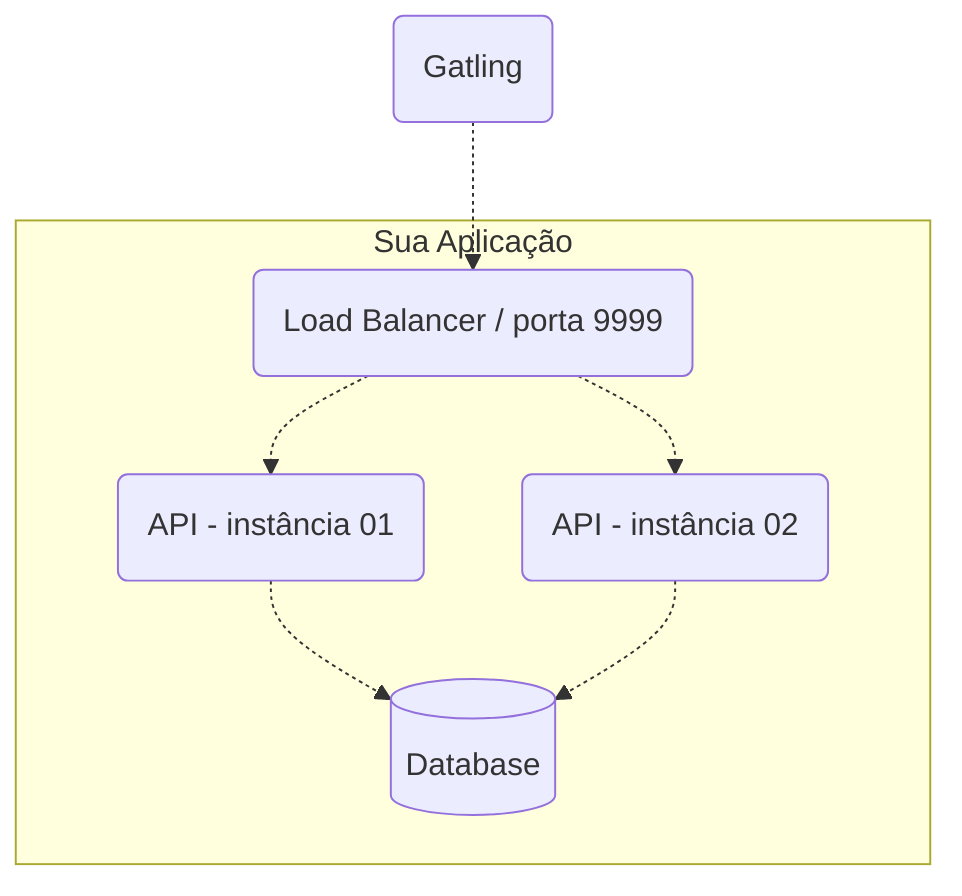

# 02 — Regras da competição e restrições

Fonte: `rinha-de-backend-2024-q1/README.md`, `RESULTADOS-HEADER.md`,
`SPECTESTENV.md` e a simulação Gatling. Este documento é a destilação
operacional — o que precisa ser verdade para o teste passar.

A competição encerrou em **10/03/2024**. Não há submissão a fazer; usamos as
regras como especificação de um exercício.

---

## 1. Contrato HTTP

### `POST /clientes/[id]/transacoes`

Requisição:
```json
{ "valor": 1000, "tipo": "c", "descricao": "descricao" }
```

| Campo | Regra |
| - | - |
| `[id]` (URL) | inteiro, identificação do cliente |
| `valor` | inteiro **positivo**, em centavos. Não aceitar fracionário |
| `tipo` | exatamente `"c"` (crédito) ou `"d"` (débito) |
| `descricao` | string de **1 a 10** caracteres |

Todos obrigatórios.

Resposta `HTTP 200`:
```json
{ "limite": 100000, "saldo": -9098 }
```

Códigos:

| Situação | Status |
| - | - |
| Sucesso | **200** (obrigatoriamente; não 201) |
| Débito estouraria o limite | **422**, sem aplicar a transação |
| Payload fora da especificação | **422** |
| `valor` não inteiro | **422** ou **400** |
| Cliente inexistente | **404** |

Corpo das respostas de erro não é verificado.

**Regra de saldo**: um débito nunca pode deixar `saldo < -limite`. Cliente com
limite 1000 nunca pode ter saldo abaixo de -1000. Saldo -1001 é inconsistência.

### `GET /clientes/[id]/extrato`

Resposta `HTTP 200`:
```json
{
  "saldo": {
    "total": -9098,
    "data_extrato": "2024-01-17T02:34:41.217753Z",
    "limite": 100000
  },
  "ultimas_transacoes": [
    { "valor": 10, "tipo": "c", "descricao": "descricao",
      "realizada_em": "2024-01-17T02:34:38.543030Z" }
  ]
}
```

- `total` — saldo total atual, não apenas das transações listadas
- `data_extrato` — data/hora da consulta
- `ultimas_transacoes` — até **10** transações, ordenadas por data/hora
  **decrescente** (mais recente primeiro). Lista vazia se não houver.
- Cliente inexistente → **404**

---

## 2. Clientes pré-cadastrados

| id | limite | saldo inicial |
| - | - | - |
| 1 | 100000 | 0 |
| 2 | 80000 | 0 |
| 3 | 1000000 | 0 |
| 4 | 10000000 | 0 |
| 5 | 500000 | 0 |

⚠️ **Não cadastrar o cliente 6** — o teste verifica que ele retorna 404.

Note que só existem **5 clientes** recebendo ~340 req/s. A concentração é
proposital: força contenção máxima em pouquíssimas linhas.

---

## 3. Arquitetura mínima obrigatória



- **Load balancer** com algoritmo **round robin**, escutando na **porta 9999**.
  Livre escolha (nginx, HAProxy, Traefik, ou próprio).
- **2 instâncias** de servidor web atrás do LB.
- **Um banco de dados** relacional ou não relacional. **Proibido** banco cuja
  característica principal seja armazenamento em memória (Redis é citado
  nominalmente).

Componentes adicionais são permitidos, desde que os limites totais sejam
respeitados e sem má-fé (ex.: declarar Postgres e usar só Redis).

**Implicação prática do "2 instâncias"**: o estado precisa ser compartilhado.
Cache em memória de processo quebra a consistência entre as instâncias.

---

## 4. Restrições de recursos

Soma de **todos** os serviços declarados:

| Recurso | Limite total |
| - | - |
| CPU | **1.5** |
| Memória | **550MB** |

Declarado por serviço via `deploy.resources.limits`, usando `MB` como unidade:

```yaml
deploy:
  resources:
    limits:
      cpus: "0.45"
      memory: "100MB"
```

A distribuição entre serviços é **livre** — e é uma das principais alavancas de
otimização do desafio.

---

## 5. Regras operacionais

- **Prontidão em 40s**: antes do teste, um script faz `GET /clientes/1/extrato`
  a cada 2s por até 40s. Tudo precisa estar de pé nesse prazo.
- **Imagens públicas**: obrigatório para submissão real (Docker Hub). Irrelevante
  para uso local.
- **Plataforma `linux/amd64`**: `docker buildx build --platform linux/amd64`.
- Porta 9999 exposta pelo load balancer.
- Repositório de código-fonte público (era requisito de submissão).

---

## 6. O que a simulação Gatling realmente testa

Arquivo: `load-test/user-files/simulations/rinhabackend/RinhaBackendCrebitosSimulation.scala`

Executa em fases sequenciais (`andThen`):

### Fase 1 — Concorrência
- 25 débitos de valor 1 no cliente 1, **todos disparados de uma vez**
  (`atOnceUsers(25)`). Todos devem retornar 200.
- Em seguida, `GET /clientes/1/extrato` → `saldo.total` deve ser **exatamente -25**.
- Depois 25 créditos de valor 1, também simultâneos → saldo deve voltar a **0**.

> É aqui que morre quem faz read-then-write não atômico. Qualquer lost update
> aparece como saldo != -25.

### Fase 2 — Validações funcionais (por cliente, 1 a 5)
- `GET extrato` → `limite` correto e `total` = 0
- POST crédito 1 "toma", POST débito 1 "devolve"
- `GET extrato` → `ultimas_transacoes[0]` = "devolve"/d/1,
  `ultimas_transacoes[1]` = "toma"/c/1 → **ordem decrescente é verificada**
- POST crédito "danada" + **5 GETs de extrato em paralelo** (`.resources(...)`),
  todos exigindo ver a transação e o saldo exato retornado pelo POST
  → **read-your-writes obrigatório**
- Payloads inválidos, todos exigindo 422 ou 400:
  - `"valor": 1.2` (não inteiro)
  - `"tipo": "x"`
  - `"descricao": "123456789 e mais um pouco"` (> 10 chars)
  - `"descricao": ""` (vazia)
  - `"descricao": null`
- `GET /clientes/6/extrato` → **404**

### Fase 3 — Carga (4 minutos)

| Cenário | Ramp (2 min) | Constante (2 min) |
| - | - | - |
| débitos | 1 → 220 req/s | 220 req/s |
| créditos | 1 → 110 req/s | 110 req/s |
| extratos | 1 → 10 req/s | 10 req/s |

Pico combinado: **~340 req/s**. Total: **61.503 requisições** — número medido
nas execuções do experimento 05, não estimado.

Valores aleatórios: cliente 1-5, valor 1-10000, descrição alfanumérica de 10 chars.

Durante toda a carga, **cada resposta** é validada:
- débitos: status ∈ {200, 422}; se 200, `saldo >= -limite`
- créditos: status = 200; `saldo >= -limite`
- extratos: `saldo.total >= -limite`

---

## 7. Critérios de pontuação

Base: **USD 100.000**, com descontos.

### Multa de SLA
```
(98 - percentual_de_sucesso) * USD 1.000
```
onde "sucesso" = respondida **abaixo de 250ms** com status 200 ou 422.
Em 98% ou mais, multa zero. Não há bônus por superar 98%.

Exemplo: 95% → `(98-95) × 1000` = **USD 3.000**.

### Multa de consistência
```
quantidade_de_inconsistencias * USD 803,01
```
Cada resposta em que o teste detecta saldo inconsistente (limite ultrapassado ou
extrato divergente).

Exemplo: 10 inconsistências → **USD 8.030,10**.

> **Peso relativo**: uma inconsistência custa o equivalente a 0,8 ponto percentual
> de SLA. Numa carga de 61.503 requisições, uma falha sistêmica de concorrência
> gera centenas de inconsistências e zera o prêmio facilmente. **Correção primeiro,
> velocidade depois.**

---

## 8. Ambiente oficial de referência

| Item | Valor |
| - | - |
| CPU | 4 vCPU Intel Xeon Platinum 8370C @ 2.80GHz — **2 núcleos físicos com hyper-threading** (`v` = virtual), VM Azure |
| Memória | 15 GB |
| SO | Ubuntu 23.04, kernel 6.2 azure |
| Docker | 25.0.3 |
| Gatling | 3.10.3 (nós usamos a 3.15.1 — ver doc 04) |
| Java | OpenJDK 21.0.1 |

Nossa máquina (20 vCPU / 31GB) é substancialmente mais folgada — em especial
porque no servidor oficial o próprio Gatling competia por CPU com a aplicação.
**Nossos números não são comparáveis 1:1 com o ranking oficial**; são válidos
para comparação entre nossas próprias implementações.

---

## 9. Checklist de conformidade

```
[ ] LB round robin na porta 9999
[ ] 2 instâncias de API
[ ] 1 banco de dados persistente (não in-memory)
[ ] soma de cpus <= 1.5
[ ] soma de memory <= 550MB (unidade em MB)
[ ] limites declarados em TODOS os serviços
[ ] 5 clientes com limites corretos, saldo 0
[ ] cliente 6 NÃO existe -> 404
[ ] POST sucesso -> 200 (nunca 201)
[ ] débito estourando limite -> 422
[ ] valor fracionário -> 422/400
[ ] tipo inválido -> 422/400
[ ] descricao vazia / null / >10 chars -> 422/400
[ ] extrato ordenado decrescente, máx 10
[ ] read-your-writes (POST seguido de GET vê a transação)
[ ] stack de pé em < 40s
```
